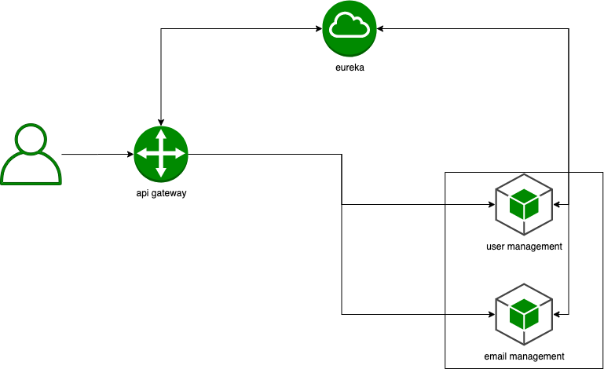

# week6 homework

## service



- user management:


```
curl -X POST \
  http://${host}/consumers/13 \
  -H 'Content-Type: application/json' \
  -d '{
	"name": "consumer11",
	"age": "10",
	"email": "consumer1@example.com"
}'

curl -X GET \
  http://${host}/consumers/13 \
  -H 'Content-Type: application/json' \

curl -X PUT \
  http://${host}/consumers/13 \
  -H 'Content-Type: application/json' \
  -d '{
	"name": "consumer11",
	"age": "10",
	"email": "consumer1@example.com"
}'

curl -X DELETE \
  http://${host}/consumers/13 \
  -H 'Content-Type: application/json' 
```

- email management

```
curl -X GET \
  http://localhost:8080/emails/2 
```

## start service

### without docker

1 start eureka server

```bash
git clone git@github.com:doudou1212/server-center.git

export PORT=9000
./gradlew bootRun
```

2 start user management server

```bash
git clone git@github.com:doudou1212/user-management-api.git

docker-compose up postgres_base
export DB_HOST=0.0.0.0
export DB_PORT=5434
export DB_NAME=user
export DB_USER=usermanagement
export DB_PASSWORD=password10
export EUREKA_SERVER_HOST=localhost
export EUREKA_SERVER_PORT=9000
export PORT=9001

./gradlew bootRun
```

3 start email user management server

```bash
git clone git@github.com:doudou1212/email-management-api.git

export EUREKA_SERVER_HOST=localhost
export EUREKA_SERVER_PORT=9000
export PORT=9002
./gradlew bootRun
```

4 start api gateway

```bash
git clone git@github.com:doudou1212/api-gateway.git

export EUREKA_SERVER_HOST=localhost
export EUREKA_SERVER_PORT=9000
export PORT=8081
./gradlew bootRun
```

5 check all service

```
eureka server: http://localhost:9000

user management: http://localhost:8081/service-user-management/consumers or http://localhost:9001/consumers
email management: http://localhost:8081/service-email-management/emails or http://localhost:9002/emails
```

### with docker

1 clone all repo into  same foler:  au-java-training-week6-homework (`git clone git@github.com:doudou1212/au-java-training-week6-homework.git`)

```bash
git clone git@github.com:doudou1212/server-center.git
git clone git@github.com:doudou1212/user-management-api.git
git clone git@github.com:doudou1212/email-management-api.git
git clone git@github.com:doudou1212/api-gateway.git
```

2 start server

```bash
docker-compose up user_management_api
docker-compose up email_management_api
docker-compose up api_gateway
```

Then, insert one user

```bash
curl -X POST \
  http://0.0.0.0:8081/service-user-management/consumers \
  -H 'Content-Type: application/json' \
  -d '{
	"name": "consumer11",
	"age": "10",
	"email": "consumer1@example.com"
}'
```

Check the user info:
```http://0.0.0.0:8081/service-user-management/consumers/1```

## Cons

- user-management-api test coverage is not 100%.
- docker-compose is vulnerable，when access user-management-api by api gateway or user server directly, it's easy to break docker container (user-management-api, api-gateway).

## Reference

email management api: https://github.com/doudou1212/email-management-api

user management api: https://github.com/doudou1212/user-management-api

eureka server(server center): https://github.com/doudou1212/server-center

api gateway: https://github.com/doudou1212/api-gateway
